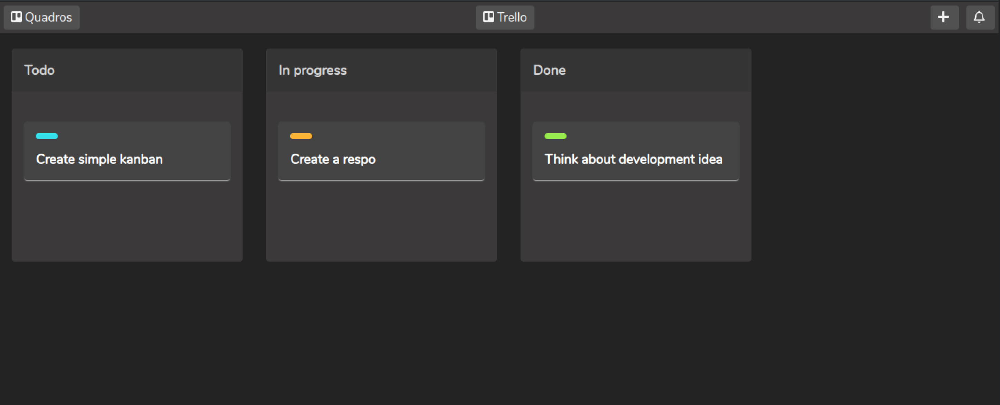

<h2 align="center"> 💧 Drag and Drop - Trello </h2>

Simple Drang and Drop using only HTML, CSS and JavaScript.

  

<!-- CONTACT -->
## 🏗️ Build with

* HTML5
* CSS3
* JavaScript
* [HTML Drag and Drop](https://developer.mozilla.org/en-US/docs/Web/API/HTML_Drag_and_Drop_API)

Project Link: [GitHub](https://github.com/DaviLima99/coding-front)

<!-- MARKDOWN LINKS & IMAGES -->
<!-- https://www.markdownguide.org/basic-syntax/#reference-style-links -->
[contributors-shield]: https://img.shields.io/github/contributors/DaviLima99/godeliver-web.svg?style=flat-square
[contributors-url]: https://github.com/DaviLima99/godeliver-web/graphs/contributors
[forks-shield]: https://img.shields.io/github/forks/DaviLima99/godeliver-web.svg?style=flat-square
[forks-url]: https://github.com/DaviLima99/godeliver-web/network/members
[stars-shield]: https://img.shields.io/github/stars/DaviLima99/godeliver-web.svg?style=flat-square
[stars-url]: https://github.com/DaviLima99/godeliver-web/stargazers
[issues-shield]: https://img.shields.io/github/issues/DaviLima99/godeliver-web.svg?style=flat-square
[issues-url]: https://github.com/DaviLima99/godeliver-web/issues
[license-shield]: https://img.shields.io/github/license/DaviLima99/godeliver-web.svg?style=flat-square
[license-url]: https://github.com/DaviLima99/godeliver-web/blob/master/LICENSE.txt
[linkedin-shield]: https://img.shields.io/badge/-LinkedIn-black.svg?style=flat-square&logo=linkedin&colorB=555
[linkedin-url]: https://www.linkedin.com/in/davilima99/
