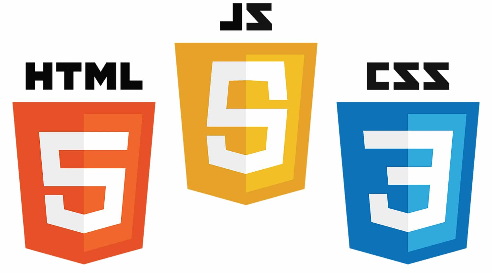

[![Contributors][contributors-shield]][contributors-url]
[![Forks][forks-shield]][forks-url]
[![Stargazers][stars-shield]][stars-url]
[![Issues][issues-shield]][issues-url]
[![LinkedIn][linkedin-shield]][linkedin-url]

<!-- PROJECT LOGO -->
 

  

  <h2 align="center"> CondigFront </h2>

<!-- ABOUT THE PROJECT -->
## About The Project

Repo where I build front-end utilities using only HTML, CSS and JavaScript.

* [Drag And Drop](https://github.com/DaviLima99/coding-front/tree/master/DragAndDrop) - Simple Drag and Drop inspiring on Trello.
<!-- CONTRIBUTING -->
## Contributing

Contributions are what make the open source community such an amazing place to be learn, inspire, and create. Any contributions you make are **greatly appreciated**.

1. Fork the Project
2. Create your Feature Branch (`git checkout -b feature/AmazingFeature`)
3. Commit your Changes (`git commit -m 'Add some AmazingFeature'`)
4. Push to the Branch (`git push origin feature/AmazingFeature`)
5. Open a Pull Request

<!-- LICENSE -->
## License

Distributed under the MIT License. See `LICENSE` for more information.

<!-- CONTACT -->
## Contact

* Davi N. Lima - **davi.n.lima99@gmail.com**

Project Link: [GitHub](https://github.com/DaviLima99/coding-front)

<!-- MARKDOWN LINKS & IMAGES -->
<!-- https://www.markdownguide.org/basic-syntax/#reference-style-links -->
[contributors-shield]: https://img.shields.io/github/contributors/DaviLima99/godeliver-web.svg?style=flat-square
[contributors-url]: https://github.com/DaviLima99/godeliver-web/graphs/contributors
[forks-shield]: https://img.shields.io/github/forks/DaviLima99/godeliver-web.svg?style=flat-square
[forks-url]: https://github.com/DaviLima99/godeliver-web/network/members
[stars-shield]: https://img.shields.io/github/stars/DaviLima99/godeliver-web.svg?style=flat-square
[stars-url]: https://github.com/DaviLima99/godeliver-web/stargazers
[issues-shield]: https://img.shields.io/github/issues/DaviLima99/godeliver-web.svg?style=flat-square
[issues-url]: https://github.com/DaviLima99/godeliver-web/issues
[license-shield]: https://img.shields.io/github/license/DaviLima99/godeliver-web.svg?style=flat-square
[license-url]: https://github.com/DaviLima99/godeliver-web/blob/master/LICENSE.txt
[linkedin-shield]: https://img.shields.io/badge/-LinkedIn-black.svg?style=flat-square&logo=linkedin&colorB=555
[linkedin-url]: https://www.linkedin.com/in/davilima99/
